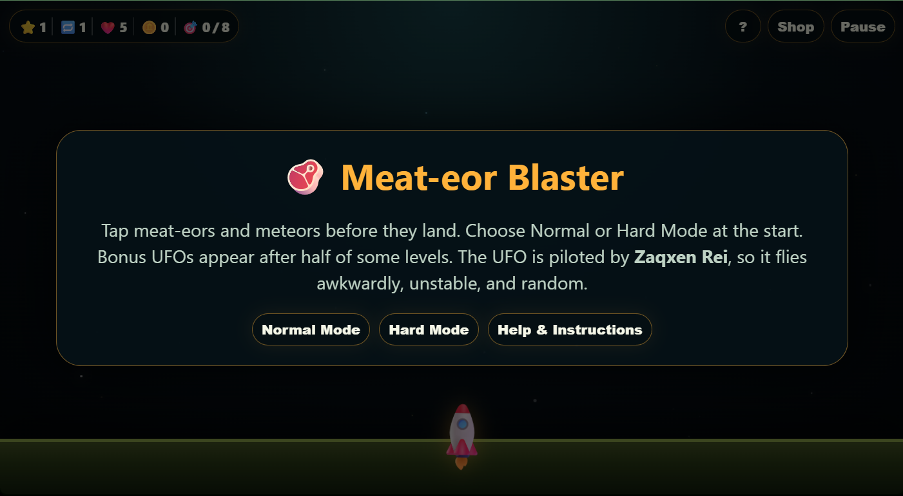

# Meat-eor Blaster

**Meat-eor Blaster** is a single-file HTML arcade game where you defend the planet from falling meat-eors and meteors using rocket lock-on attacks, upgradeable trails, blast-radius explosions, special UFO bonus events, bomb hazards, and share-ready final results.



## Play Online

[Play Meat-eor Blaster](https://zaqxen.github.io/meat-eor-blaster/)

## How to Play

- Tap or click falling meat-eors and meteors before they hit the ground.
- Tapping a target locks it in place and launches a rocket.
- You can tap the same locked target multiple times based on your **Multi-Missile Tap** level.
- Mobile multi-touch is supported, so multiple fingers can hit multiple targets at once.
- If a meat-eor or meteor reaches the ground, you lose a life and it counts as a missed target.
- Bombs are extra hazards and do **not** count toward the required target total.
- Bombs are not affected by explosion radius; only direct tapping triggers bomb danger.
- The final score screen is designed to fit small mobile screens for easy screenshots and sharing.
- If the player taps empty space instead of a valid target, a tiny red crosshair briefly appears at the exact tap location to confirm the missed click.

## Game Modes

### Normal Mode

- Easier starting pace.
- Bombs begin appearing only after the first 12-level difficulty cycle.
- Good for casual play and learning the mechanics.

### Hard Mode

- Hard Mode is selected only at the beginning of a run.
- Uses a red theme.
- Faster falling objects.
- More targets per level.
- More bombs.
- Bombs can appear from level 1.
- Final results show that the run was completed in Hard Mode.

## Levels and Difficulty

- The displayed level keeps increasing: 1, 2, 3 ... 100 and beyond.
- Internally, difficulty cycles every 12 levels.
- Every difficulty reset adds more pressure through more targets and more bomb hazards.
- Every 100 levels, the player receives a milestone congratulations message from developer **Mark Morgan**.

## Scoring, Rank, and Final Results

The final result card shows:

- Player name, entered after game over.
- Date and time with a 3-letter month.
- Active run time, excluding paused time.
- Total score.
- Rank.
- Mode.
- Level reached.
- Run cycle.
- Credits.
- UFOs caught and missed.
- Large final-result numbers use compact notation such as 1.0K and 1.0M so the share card still fits small screens.
- Missed targets.
- Upgrade levels.
- Bomb immunity remaining.
- Saved-run continue count.
- Danger continue count, used when a saved run was continued after the last saved falling target was close to the ground.
- Meat, chicken, rib, meteor, and UFO collection icons.

Ranking considers both score and clean play:

- Hard Mode receives a score multiplier bonus.
- Missed meat-eors and meteors reduce the ranking score.
- Missed UFOs reduce the ranking score more heavily.
- Saved-run continues apply a small ranking penalty.
- Danger continues apply a stronger ranking penalty and prevent a perfect S+ result.
- **S+ requires no missed targets, no missed UFOs, and no danger continues.**

## Scoring and Rewards

- 🥩 / 🍗 / 🍖 Meat-eors: earn credits and count toward final collection stats.
- ☄️ Meteors: worth more credits than meat-eors.
- 🛸 UFOs: bonus event that appears randomly after half of some levels.
- Capturing a UFO grants bonus credits and extra lives.
- Every 1000 current available credits gives 1 bomb immunity.
- Bomb immunity is based on current available credits, not accumulated lifetime credits or UFO captures.

## Bombs and Bomb Immunity

- Bombs are extra hazards, not part of the meat-eor/meteor target count.
- Bombs are ignored by explosion radius.
- Directly tapping a bomb normally ends the game.
- If you have bomb immunity based on your current available credits, an accidental bomb tap is blocked.
- Using bomb immunity costs:
  - 1000 current credits
  - 1 Rocket Size level
  - 1 Multi-Missile Tap level
- Rocket Size and Multi-Missile Tap cannot drop below level 1.

## UFO Bonus and UFO Droppings

The UFO is piloted by **Zaqxen Rei**, which explains why it flies awkwardly, unstable, and random.

- The UFO starts with 1 shield.
- Higher levels and later run cycles increase UFO shields and speed.
- UFO shields are capped so the bonus remains possible:
  - Normal Mode max shield: 7
  - Hard Mode max shield: 9
- As UFO shields increase, the UFO stays longer so players have time to capture it.
- Multi-Missile Tap helps catch the UFO by removing more shields per tap.
- The flying UFO shows only the UFO itself, with no meat bundle/orbiting meat around it.
- Once shields reach 0, the game pauses for a special rocket hit and a large comedic meat explosion reward scene.

Starting at level 30, UFOs can drop hazards every few seconds:

- 🔪 Knives
- 🔨 Hammers
- 🔧 Wrenches
- 🎰 Slot machines

The UFO now initializes its drop timer when it spawns, so the random tool droppings can appear correctly instead of only the end-of-visit slot machine appearing.

Tool drops cannot be destroyed. If they reach the ground, the player loses 1 life.

A slot machine can drop near the very end of a UFO visit. If it reaches the ground, it steals a random 100-1000 credits and can make the player bankrupt or negative in credits.

If the player finishes the level before UFO droppings reach the bottom, those droppings are cleared and do not count against the player.

## Upgrades

- **Rocket Size**: increases the rocket's visual size and blast radius. Bigger rocket means bigger blast.
- **Multi-Missile Tap**: lets you tap the same locked target multiple times, launching more rockets. Also removes more UFO shields per tap.
- **Trail Length**: makes rocket trails last longer and unlocks stronger trail visuals.
- **Explosion Effects**: visual blast upgrades unlocked by level and Rocket Size.
- **Rocket Trails**: cosmetic trail styles unlocked by level and Trail Length.

If the player maxes out an upgrade or upgrade category, the game congratulates them.

## Local Save, Continue, and Tamper Checks

The game uses browser `localStorage` to keep a local checkpoint in the same browser.

The saved checkpoint keeps durable run values:

- Current level, difficulty cycle, and mode.
- Current lives, credits, score, and active run time.
- Upgrade levels, owned effects, selected effect, owned trails, selected trail, and Lite Mode choice.
- Collection stats, missed targets, missed UFOs, UFO captures, and UFO life rewards.
- Saved-run continue count and danger continue count.

The checkpoint does **not** save live falling objects, rockets, UFO positions, or mid-screen DOM state. When the player continues a saved run, the game resumes cleanly from the saved level state rather than recreating exact objects on screen.

Recorded penalties do not roll back. If a meat-eor or meteor already missed, or a UFO already escaped, that miss remains saved even if the player later continues and restarts the level flow.

To make restart abuse visible, the game records every saved-run continue. It also checks the active falling targets at save time. If the closest falling target was near the ground, the next continue is recorded as a **danger continue** on the final result screen.

Danger continues are meant to reveal cases where a player may have closed or reloaded to avoid an almost-certain miss. They also reduce rank more than normal saved-run continues.

The local save is tamper-resistant for casual editing:

- The payload is normalized and clamped to allowed ranges.
- Level, difficulty level, and run cycle must match the expected 12-level cycle.
- Owned cosmetic IDs must be known valid IDs.
- The save includes a signature and mirror copy.
- If the signature check fails, the saved run is blocked and ignored.

Because this is a single-file offline browser game, localStorage protection cannot be as strong as a server-verified account save. A determined user with full access to the page code can still reverse-engineer client-side checks, but casual value editing is blocked.

## Starter Pack

The player starts with a default starter explosion effect:

- A simple expanding white circle.
- Shows the current blast radius clearly.
- Helps the player understand how Rocket Size affects blast range.

## Shop and Workshop

- The Rocket Workshop lets players buy upgrades, explosion effects, and rocket trails.
- Credits stay visible at the top while scrolling the shop.
- The Shop shows the exact current credit total, even when the gameplay HUD shortens the number.
- When no upgrades or effects are currently affordable, **Shop Upgrades** becomes **View Upgrades**.
- Shop, Help, Pause, and Workshop screens are scrollable on mobile when needed.
- At level clear, the game highlights the strongest affordable upgrade or cosmetic when one is available.

## Ground and Lives

The ground color reflects remaining lives:

- Low lives shift the ground toward red.
- More lives shift the ground toward green.
- At high lives, flowers and trees start growing randomly on the ground.
- Plants disappear again as lives go down.

## HUD and Pause Screen

During gameplay, the HUD uses smaller compact icons and compact number formatting:

- ⭐ Level
- 🔁 Run cycle
- ❤️ Lives
- 🪙 Credits
- 🎯 Targets cleared

Numbers of 1000 and higher shorten to K/M/B/T format, for example 1000 becomes 1.0K and 1000000 becomes 1.0M. Exact current credits are shown inside the Rocket Workshop.

The Pause screen expands these icons into full text and also shows:

- UFOs captured
- Bomb immunity
- Current mode
- Continue button
- Shop button
- A small `?` Help button so players can reopen Help & Instructions during a run, not only from the title screen.
- Local save status, including saved-run continues and danger continues.

## Developer Note

**Meat-eor Blaster** was built and developed by **Mark Morgan** using AI-assisted implementation.

The game concept, design direction, gameplay rules, balance decisions, and logic were created by **Mark Morgan**.

It is dedicated to his son, **Zaqxen Rei**, the pilot of the awkward, unpredictable UFO.

A small **?** button inside the game shows this developer and dedication information.

## Lite Mode

Lite Mode is available inside the Rocket Workshop for low-spec devices.

It keeps the gameplay rules the same, but replaces heavier visual effects:

- Explosion effects become simple colored blast circles with no particles.
- Rocket trails become simple fading gradient lines with no particles.
- Lite visuals intensify through white, yellow, light orange, orange, light red, and deep red.

## Mobile Notes

The game is designed to work on small mobile screens, including iPhone SE-sized displays.

- Gameplay is no-scroll so taps and multi-touch feel responsive.
- Double-tap zoom is disabled for smoother mobile play.
- Text selection is disabled except inside player-name input fields.
- Final result is no-scroll and compact for screenshots.
- Help, Pause, Workshop, About, and other information screens can scroll when needed on mobile.
- Android dynamic browser bars and safe-area insets are handled with visual-viewport sizing so the bottom ground, launcher area, overlay cards, and bottom buttons stay visible.
- The game supports portrait and landscape.
- Regular browser resize recalibrates the playfield without overwriting the Level Cleared, Shop, Help, or Pause screens.
- Rotation still pauses active gameplay when safe, but it keeps level-end overlays intact so the next level cannot get stuck waiting for a manual pause/resume.
- Screen lock, app switching, and focus changes pause the game so the player can resume safely.
- Continuing from a local save works only in the same browser/localStorage profile unless the browser clears site data.

## Run Locally

Open the HTML file directly in a browser:

```bash
open index.html
```

Or just double-click the HTML file.
